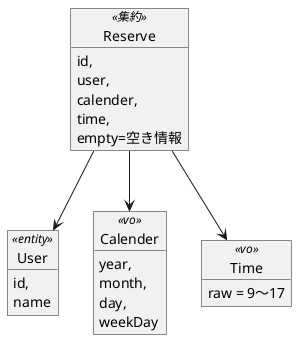
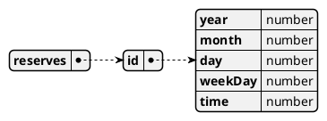

#### 内容
- カレンダーから予約できる機能
  

#### オブジェクト 

```plantuml
@startuml
object Reserve<<集約>> {
  id,
  user,
  calender,
  time,
  empty=空き情報
}
object User<<entity>> {
  id,
  name
}
object Calender<<vo>> {
  year,
  month,
  day,
  weekDay
}
object Time<<vo>> {
  raw = 9～17
}

Reserve --> User
Reserve --> Calender
Reserve --> Time

@enduml
```
### firestore

```plantuml
@startjson
{
  "reserves" : {
    "id" : {
      "year" : "number",
      "month" : "number",
      "day" : "number",
      "weekDay" : "number",
      "time" : "number"
    }
  }
}

@endjson
```

#### 課題
カレンダーに予約状況追加わからない
- DBは予約情報のみもっている
- DBをUIで作成したカレンダー情報に結び付けたいができない
- DBにカレンダー情報があるべき？
  ユーザ情報を想定する場合はあったほうがよい
